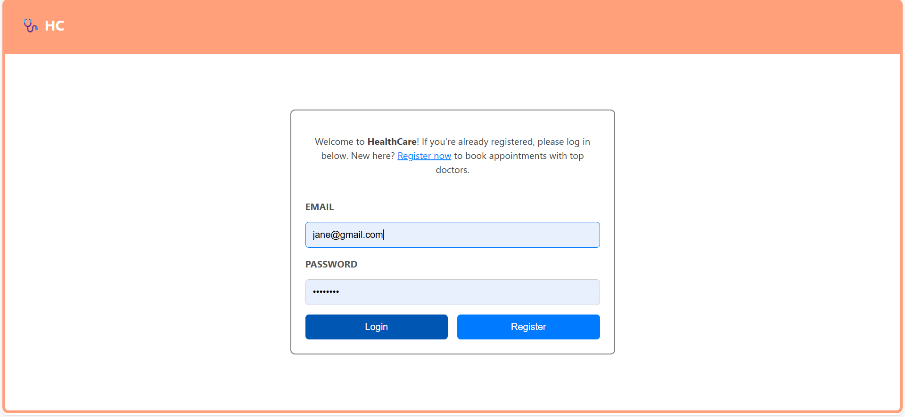
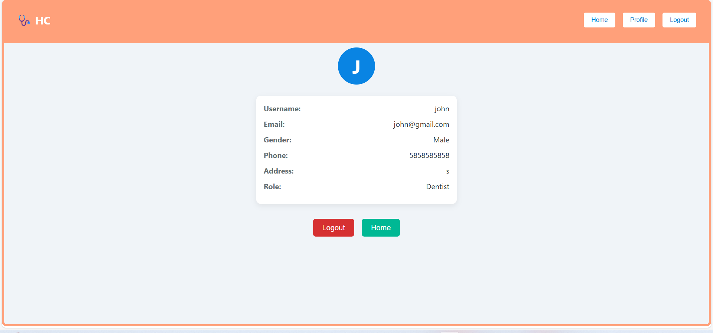

# 🦷 HealthCare2 Web Application  

A full-stack web app for **dental scan management** with **role-based authentication**.  

---

## ✨ Features  

- 🔐 **Role-based Login:** Technician and Dentist users.  
- 🧑‍🔬 **Technician:** Upload patient scan images and details.  
- 🦷 **Dentist:** View all scans, see thumbnails, view full images, and download PDF reports.  
- ☁️ **Cloud Storage:** Images uploaded to Cloudinary, details stored in SQLite.  
- 📄 **PDF Report:** Generate and download scan reports with embedded images.  
- 📱 **Responsive UI:** Works seamlessly on desktop and mobile devices.  

---

## 📸 Screenshots  

_All images are located in the `assets` folder._  

### Login Page  
  

### Register Page  
  

### Technician Scan Upload  
  

### Dentist Scan Viewer  
  

### PDF Report Modal  
  

### Profile Page  
  

---

## 🛠️ Tech Stack  

- **Frontend:** React, react-router-dom, react-spinners, jspdf  
- **Backend:** Node.js, Express, SQLite, bcrypt, jsonwebtoken, multer, cloudinary  
- **Cloud Storage:** Cloudinary  

---

## 📂 Folder Structure  

```
HealthCare2/
│
├── backend/
│   ├── app.js
│   ├── data.db
│   └── ...other backend files
│
├── frontend/
│   ├── src/
│   │   ├── components/
│   │   │   ├── Header/
│   │   │   ├── Home/
│   │   │   ├── Login/
│   │   │   ├── Register/
│   │   │   ├── Profile/
│   │   │   ├── ProtectedRoute/
│   │   │   ├── Loader/
│   │   │   ├── ScanUpload/
│   │   │   ├── ScanViewer/
│   │   │   └── PDFReport/
│   │   └── App.js
│   └── package.json
│
├── assets/
│   ├── login.png
│   ├── register.png
│   ├── scan_upload.png
│   ├── scan_viewer.png
│   ├── pdf_report.png
│   ├── profile.png
│   └── ...other screenshots
│
└── README.md
```

---

## ⚙️ Setup Instructions  

### 1. Backend  

- Install dependencies:  
  ```bash
  npm install express cors sqlite3 sqlite bcrypt jsonwebtoken multer cloudinary
  ```  
- Configure **Cloudinary credentials** in `app.js`.  
- Start backend:  
  ```bash
  node app.js
  ```  
  _(Default port: **3001**)_.  

### 2. Frontend  

- Install dependencies:  
  ```bash
  npm install react react-dom react-router-dom react-scripts react-spinners jspdf
  ```  
- Start frontend:  
  ```bash
  npm start
  ```  
  _(Default port: **3000**)_.  

---

## 🚀 Usage  

1. **Register** as Technician or Dentist.  
2. **Login** with your credentials.  
3. 👨‍🔬 **Technician:** Go to Home → Upload scans.  
4. 🦷 **Dentist:** Go to Home → View scans, download PDF reports.  
5. **Profile:** View your user details.  
6. **Logout:** Securely log out.  

---

## 📝 Notes  

- Images are uploaded to **Cloudinary** and URLs are stored in the database.  
- PDF reports are generated **client-side** using `jspdf`.  
- The app is **responsive** across all devices.  

---

## 📜 License  

**MIT**  